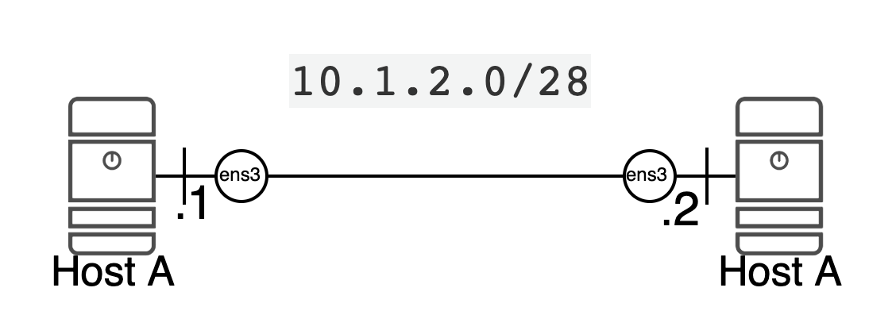
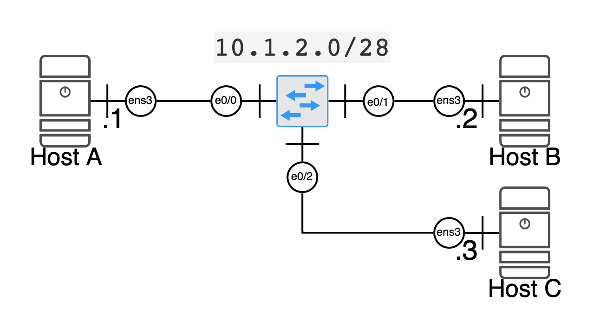
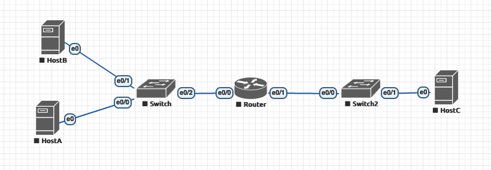
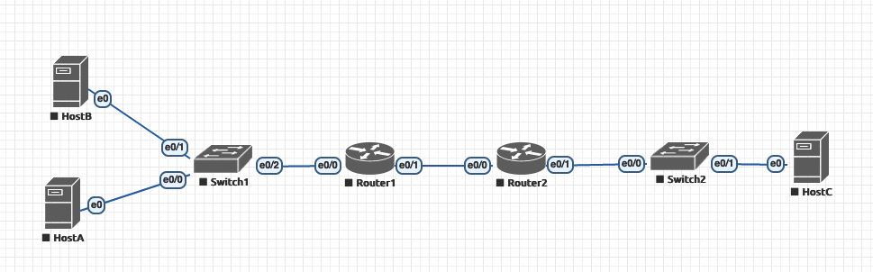
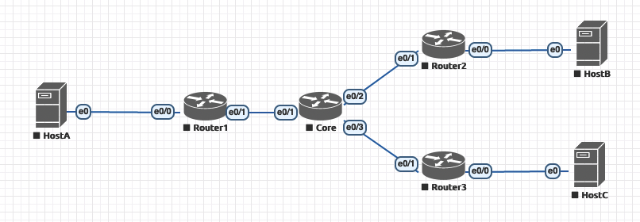

# Network Labs


## Materials

* EVE-NG instance accessible at # TODO
* User login #TODO
* [IProute2 documentation](iproute2.md)
* [Cisco Cheat Sheet](ciscocheatsheet.md)
* [TCPDump Primer](https://danielmiessler.com/study/tcpdump/)


## Lab 1 : Two hosts directly connected with a cable



* Go to EVE-NG, open the lab 1
* Start the lab (More actions -> Start All Nodes), wait 30s  so they can boot and connect on the two hosts (click on it)
* Log as root/eve on both devices

##### Objective A: Configure Networking on Host A & B

* List all available interfaces `ip link`, you can also use the short form: `ip l` or even the brief syntax `ip -br l`

> Tip: create an alias to refer to brief command with `alias ipb="ip --brief"`. Use the Guacamole clipboard to copy/paste it in the web terminal (ctrl + alt + shift (Windows) or ctlr + command + shift (Mac)) and copy it to the CLI with a right click once you close it.

```
root@debian:~# ipb l
lo               UNKNOWN        00:00:00:00:00:00 <LOOPBACK,UP,LOWER_UP> 
ens3             DOWN           50:00:00:03:00:00 <BROADCAST,MULTICAST> 
ens4             DOWN           50:00:00:03:00:01 <BROADCAST,MULTICAST> 
ens5             DOWN           50:00:00:03:00:02 <BROADCAST,MULTICAST> 
ens6             DOWN           50:00:00:03:00:03 <BROADCAST,MULTICAST> 
```

The down part correspond to the administrative state of the interface. (to not be mixed with the operationnal state)

* Activate the interface ens3 with ` ip l set dev ens3 up`. Confirm that the interface is now up. Do the same on both hosts
* Configure the following IP addresses
  * Host A: `ip address add 10.1.2.1/28 dev ens3`
  * Host B: `ip address add 10.1.2.2/28 dev ens3`


##### Objective B: Observations

* Observe the ARP cache `ip n`on both both Host
* Confirm that everything is working by pinging HostA from HostB 

```
# ping 10.1.2.1
PING 10.1.2.1 (10.1.2.1) 56(84) bytes of data.
64 bytes from 10.1.2.1: icmp_seq=1 ttl=64 time=3.88 ms
```

* Clear the ARP cache with `ip n flush all`. Confirm it is empty with `ip n`.

* Launch a tcpdump capture in the background with `tcpdump -i ens3 -nvvv &`. Then launch a slient ping with two packets:  `ping 10.1.2.1 -c 2 2>&1 >/dev/null`

* Describe what you see.

  

## Lab 2 : Two hosts  connected with a switch


##### Objective A: Configure Networking on Host A & B

* Configure Networking the same as Lab1 on both host

> ​	Reminder for Host A:
>
> ```
> ip l set dev ens3 up
> ip address add 10.1.2.1/28 dev ens3
> ```

* Ping between A and B. What do you observe ?

##### Objective B: Configure Switch

We are going to activate the two switches interfaces.

```
enable
conf t
interface range Ethernet0/0-1
no sh
exit
exit
wr
```

Observe the switch Mac Address Table with `show mac address-table`

##### Objective C: Observe a TCP session

On Host B, launch a web server: `python3 -m http.server 80 &`

On Host B, launch a packet capture: `tcpdump -ttnnvvS port 80`

On Host A, launch a request: `wget http://10.1.2.2`

Can you spot the packets initiating the connection ? The packet requesting the index and the packet sending it ? The packets closing the connection ?


## Lab 3 : Three hosts directly connected on a switch

 

##### Objective A: Configure Networking on Host A & B & C

* Use Lab1 guidance to configure all hosts.

##### Objective B: Configure Switch

* Use Lab2 guidance to configure all ports

##### Objective C: Observations

* Ping A to B
* Ping B to C
* Observe all ARP tables
* Observe switch CAM Tables
* Ping C to A
* Observe all ARP tables
* Observe switch CAM Tables


## Lab 4: Three hosts on a switch with VLANs

> **If you already have lab3 launched, you can use it instead of re-doing Objective A** 


##### Objective A: Configure Networking on Host A & B & C

* Use Lab1 guidance to configure all hosts.


##### Objective B: Host A and B on Vlan10. Host C on Vlan20

```
enable
conf t
interface range Ethernet0/0-1
switchport access vlan 10
no sh
interface  Ethernet0/2
switchport access vlan 20
no sh
exit
exit
wr
```

* Ping A->B. Do you have an answer ?
* Ping B->C. Do you have an answer ?

##### Objective C: Host A on Vlan10. Host B moves to Vlan20. Host C on Vlan20

```
enable
conf t
interface  Ethernet0/1
switchport access vlan 20
no sh
interface range Ethernet0/2
switchport access vlan 20
no sh
exit
exit
wr
```
* Ping A->B. Do you have an answer ?
* Ping B->C. Do you have an answer ?


## Lab 5: One Router



## Lab 6: Two Routers



4:two hosts on one network, another hosts on another network (multiples router)

## Lab 7 : Several Routers and Dynamic Routing 



## Lab 8 : VRF


## NOTES


- Packet Capture and analysis: 2h30
  - tcpdump
  - Wireshark / tshark
    - usage pcap example with http, ftp, etc
